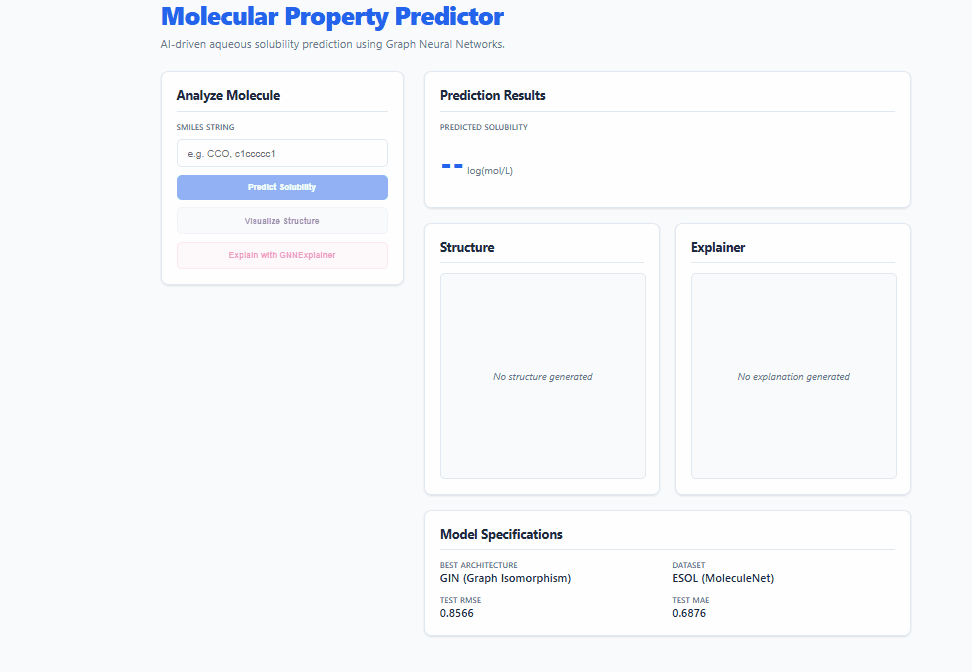
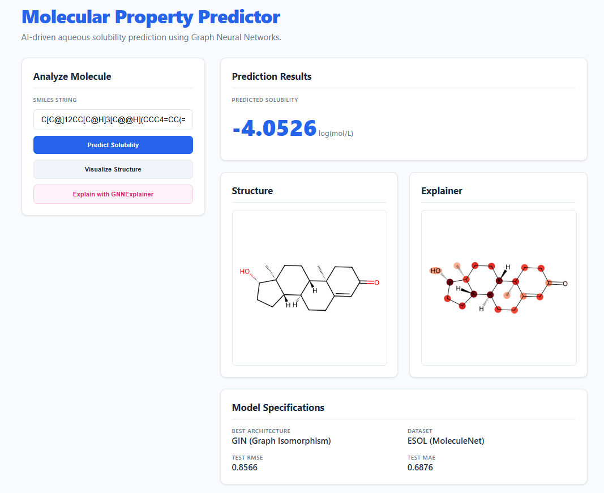

# Molecular Property Prediction using Graph Neural Networks

An end-to-end machine learning platform for molecular property prediction using Graph Neural Networks (GNNs), featuring model benchmarking, explainable AI, molecule visualization, and REST API deployment.

---

## Overview

Traditional machine learning models often struggle to capture the relational structure of molecules.

This project represents molecules as graphs:

* Atoms → Nodes
* Bonds → Edges

and applies Graph Neural Networks to predict molecular properties directly from molecular structure.

The project uses the ESOL dataset and compares multiple GNN architectures to determine the most effective approach for molecular solubility prediction.

---

## Features

### Molecular Property Prediction

Predict aqueous solubility directly from SMILES strings using trained Graph Neural Networks.

### Multiple GNN Architectures

Implemented and benchmarked:

* Graph Convolutional Network (GCN)
* GraphSAGE
* Graph Isomorphism Network (GIN)

### Model Benchmarking

All architectures are trained and evaluated using:

* Identical dataset
* Identical train/validation/test splits
* Fixed random seed
* Consistent evaluation pipeline

allowing fair comparison of model performance.

### Explainable AI

Uses GNNExplainer to identify:

* Important atoms
* Important bonds
* Influential molecular substructures

for each prediction.

### Molecule Visualization

Generate 2D molecular structures directly from SMILES strings using RDKit.

### REST API

FastAPI backend supporting:

* Prediction
* Molecule visualization
* Model explanation
* Health monitoring

### Swagger Documentation

Interactive API documentation available through FastAPI.

---

## Demo

### React Frontend Dashboard

The project includes a React frontend integrated with the FastAPI backend.

Features:

- Predict molecular solubility from SMILES strings
- Visualize molecular structures
- Explain predictions using GNNExplainer
- View model benchmark results
- Interactive user interface built with React and Vite

### Live Demo

#### Prediction Example

## Project Architecture

Input SMILES

↓

RDKit Molecule Parser

↓

Graph Construction

↓

Graph Neural Network

(GCN / GraphSAGE / GIN)

↓

Property Prediction

↓

GNNExplainer

↓

Atom-Level Explanation

---

## Dataset

Dataset:

ESOL (Delaney Solubility Dataset)

Properties:

* 1,128 molecules
* Experimental aqueous solubility values
* Widely used molecular machine learning benchmark

Split Strategy:

* Train: 80%
* Validation: 10%
* Test: 10%

Random seed fixed for reproducibility.

---

## Model Results

| Model     | MAE    | RMSE   |
| --------- | ------ | ------ |
| GCN       | 1.4526 | 1.8407 |
| GraphSAGE | 1.4160 | 1.7666 |
| GIN       | 0.6876 | 0.8566 |

### Best Performing Model

GIN (Graph Isomorphism Network)

The GIN architecture achieved the lowest error and was selected as the primary production model.

---

## Explainability

The project includes explainability using GNNExplainer.

Given a molecule, the system can:

* Generate a prediction
* Identify influential atoms
* Visualize atom importance scores
* Highlight molecular regions responsible for the prediction

This allows users to understand not only what the model predicts but also why it predicts it.

---

## API Endpoints

### Health Check

GET /health

Returns service status and model availability.

---

### Predict Solubility

POST /predict

Input:

{
"smiles": "CCO"
}

Output:

{
"predicted_solubility": -0.37
}

---

### Visualize Molecule

POST /visualize

Input:

{
"smiles": "CCO"
}

Output:

{
"image_path": "generated_molecules/CCO.png"
}

---

### Analyze Molecule

POST /analyze

Combined endpoint returning:

* Prediction
* Visualization
* Metadata

---

### Explain Prediction

POST /explain

Input:

{
"smiles": "CCO"
}

Output:

{
"prediction": -0.37,
"explanation_image": "generated_explanations/CCO_explanation.png"
}

---

## Project Structure

molecular-property-prediction-gnn/

├── data/

├── generated_explanations/

├── generated_molecules/

├── models/

│ ├── gcn_esol.pth

│ ├── graphsage_esol.pth

│ └── gin_esol.pth

├── src/

│ ├── train.py

│ ├── train_graphsage.py

│ ├── train_gin.py

│ ├── evaluate.py

│ ├── evaluate_graphsage.py

│ ├── evaluate_gin.py

│ ├── compare_models.py

│ ├── molecule_visualizer.py

│ ├── explain_gin.py

│ ├── explanation_visualizer.py

│ └── api.py

├── tests/

├── requirements.txt

└── README.md

---

## Installation

Clone the repository:

git clone https://github.com/S-Vageesh/molecular-property-prediction-gnn.git

cd molecular-property-prediction-gnn

Install dependencies:

pip install -r requirements.txt

---

## Training

Train GCN:

python src/train.py

Train GraphSAGE:

python src/train_graphsage.py

Train GIN:

python src/train_gin.py

---

## Evaluation

python src/evaluate.py

python src/evaluate_graphsage.py

python src/evaluate_gin.py

---

## Run API

uvicorn src.api:app --reload

Open:

http://localhost:8000/docs

for interactive Swagger documentation.

---

## Future Work

* React frontend dashboard
* Real-time molecule drawing interface
* Additional molecular datasets
* Hyperparameter optimization
* Docker deployment
* Cloud deployment (AWS)
* Model monitoring and analytics

---

## Key Learning Outcomes

This project demonstrates:

* Graph Neural Networks
* Molecular Machine Learning
* PyTorch Geometric
* Explainable AI
* FastAPI Development
* Model Benchmarking
* Machine Learning Engineering
* End-to-End ML System Design

---

## Author

S Vageesh

Mathematics and Computing Student

Interested in:

* Cryptography
* Machine Learning
* Graph Neural Networks
* AI Research
